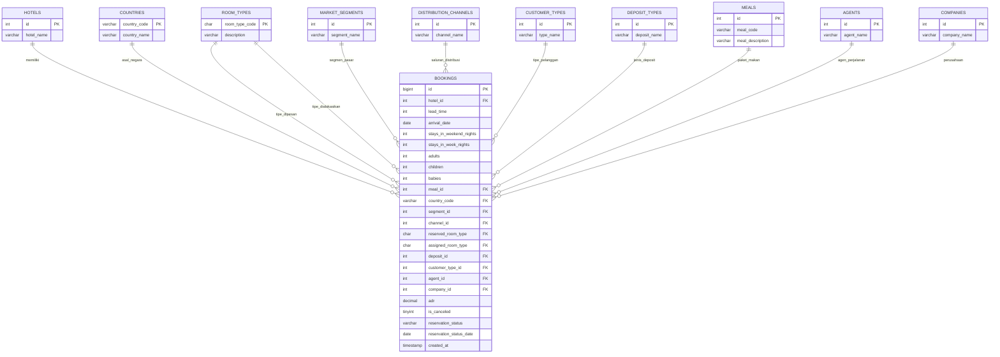
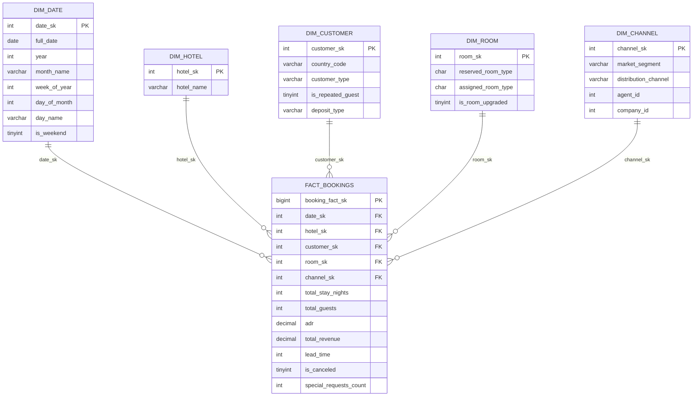
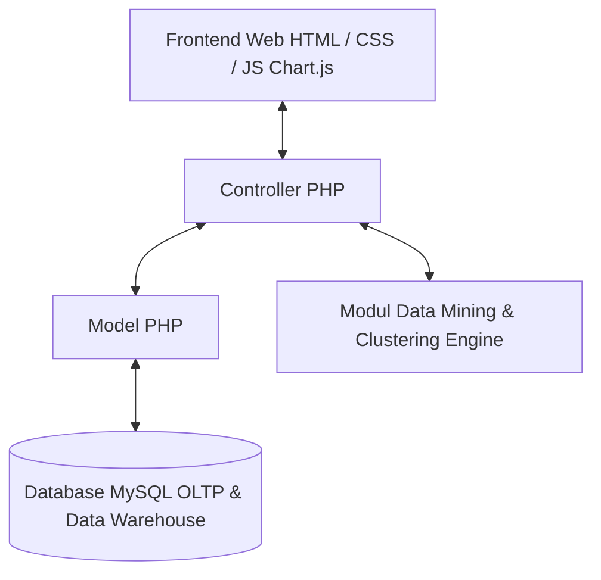

# Perancangan Database, Business Intelligence & Aplikasi Web (Hotel Booking Analytics)

Dokumen ini merupakan perencanaan dan perancangan komprehensif sistem **Business Intelligence (BI)**, Data Warehouse, dan **Aplikasi Web berbasis PHP & MySQL** yang disusun berdasarkan dataset operasional `data_booking_hotel_17000.csv`. 

Dokumen ini menyeimbangkan antara **Diagram ERD Visual**, **Struktur Tabel Detail (3NF & Star Schema)**, serta **Penjelasan Konseptual dan Analitis** dari seluruh fitur Business Intelligence (SSIS, SSAS, Data Mining, Clustering, dan SSRS).

---

## 1. Pendahuluan & Analisis Data Mentah

### 1.1 Latar Belakang & Analisis Data Mentah
Dataset `data_booking_hotel_17000.csv` mencakup **17.000+ data transaksi reservasi hotel** dengan 31 atribut utama yang mengkombinasikan tipe hotel (*Resort Hotel* dan *City Hotel*), profil kedatangan tamu, durasi menginap, saluran distribusi pemesanan, riwayat pembatalan, hingga status akhir reservasi.

### 1.2 Tujuan Sistem
1. **Sistem Operasional (OLTP)**: Menyediakan aplikasi web berbasis **PHP & MySQL** untuk mengelola transaksi pemesanan hotel harian secara terstruktur dan konsisten (3NF).
2. **Sistem Analitis (OLAP & BI)**: Menyediakan Data Warehouse berarsitektur *Star Schema* untuk analisis agregasi cepat, pelaporan eksekutif, serta pemodelan analitik preskriptif dan prediktif (Data Mining & Clustering).

---

## 2. Entity Relationship Diagram (ERD) - Skema OLTP (3NF)

### 2.1 Konsep & Penjelasan Skema OLTP
Skema OLTP (*Online Transaction Processing*) dirancang hingga **Bentuk Normal Ketiga (3NF)**. Normalisasi dilakukan dengan memisahkan entitas master/referensi (`HOTELS`, `COUNTRIES`, `ROOM_TYPES`, `MARKET_SEGMENTS`, `DISTRIBUTION_CHANNELS`, `CUSTOMER_TYPES`, `DEPOSIT_TYPES`, `MEALS`, `AGENTS`, `COMPANIES`) dari entitas transaksi utama (`BOOKINGS`).

**Keuntungan Normalisasi 3NF**:
* Mengeliminasi redundansi data teks (seperti penulisan nama segmen pasar atau negara yang berulang).
* Mencegah anomali pada saat operasi *Insert*, *Update*, dan *Delete*.
* Menjaga integritas referensial data melalui *Foreign Key Constraints*.

### 2.2 Diagram Visual ERD OLTP (Mermaid Diagram)



### 2.3 Detail Struktur Tabel ERD Skema OLTP

#### A. Tabel-Tabel Master & Referensi

##### 1. Tabel: `HOTELS`
*Penjelasan*: Menyimpan master jenis properti hotel.
| Tipe Data | Nama Atribut | Constraint | Keterangan |
| :--- | :--- | :--- | :--- |
| `int` | `id` | PK | Auto Increment, ID Unik Hotel |
| `varchar` | `hotel_name` | NOT NULL | Nama Jenis Hotel (Resort Hotel / City Hotel) |

##### 2. Tabel: `COUNTRIES`
*Penjelasan*: Menyimpan master kode dan nama negara asal tamu.
| Tipe Data | Nama Atribut | Constraint | Keterangan |
| :--- | :--- | :--- | :--- |
| `varchar` | `country_code` | PK | Kode Negara ISO 3 Karakter (PRT, GBR, ESP, USA, dll) |
| `varchar` | `country_name` | NULL | Nama Lengkap Negara |

##### 3. Tabel: `ROOM_TYPES`
*Penjelasan*: Menyimpan kode dan kategori tipe kamar yang tersedia di hotel.
| Tipe Data | Nama Atribut | Constraint | Keterangan |
| :--- | :--- | :--- | :--- |
| `char` | `room_type_code` | PK | Kode Tipe Kamar (A, B, C, D, E, F, G, H, L, P) |
| `varchar` | `description` | NULL | Deskripsi Fasilitas & Kategori Kamar |

##### 4. Tabel: `MARKET_SEGMENTS`
*Penjelasan*: Menyimpan kategori segmen pasar asal pemesanan.
| Tipe Data | Nama Atribut | Constraint | Keterangan |
| :--- | :--- | :--- | :--- |
| `int` | `id` | PK | Auto Increment, ID Segmen Pasar |
| `varchar` | `segment_name` | NOT NULL, UNIQUE | Segmen Pasar (Direct, Corporate, Online TA, Offline TA/TO, Groups) |

##### 5. Tabel: `DISTRIBUTION_CHANNELS`
*Penjelasan*: Menyimpan saluran/kanal yang digunakan untuk melakukan pemesanan.
| Tipe Data | Nama Atribut | Constraint | Keterangan |
| :--- | :--- | :--- | :--- |
| `int` | `id` | PK | Auto Increment, ID Saluran |
| `varchar` | `channel_name` | NOT NULL, UNIQUE | Saluran Distribusi (Direct, Corporate, TA/TO, GDS) |

##### 6. Tabel: `CUSTOMER_TYPES`
*Penjelasan*: Menyimpan kategori tipe hubungan pelanggan dengan hotel.
| Tipe Data | Nama Atribut | Constraint | Keterangan |
| :--- | :--- | :--- | :--- |
| `int` | `id` | PK | Auto Increment, ID Tipe Pelanggan |
| `varchar` | `type_name` | NOT NULL | Jenis Pelanggan (Transient, Contract, Group, Transient-Party) |

##### 7. Tabel: `DEPOSIT_TYPES`
*Penjelasan*: Menyimpan jenis ketentuan deposit uang muka pemesanan.
| Tipe Data | Nama Atribut | Constraint | Keterangan |
| :--- | :--- | :--- | :--- |
| `int` | `id` | PK | Auto Increment, ID Deposit |
| `varchar` | `deposit_name` | NOT NULL | Jenis Deposit (No Deposit, Non Refund, Refundable) |

##### 8. Tabel: `MEALS`
*Penjelasan*: Menyimpan master opsi paket makanan yang dipilih tamu.
| Tipe Data | Nama Atribut | Constraint | Keterangan |
| :--- | :--- | :--- | :--- |
| `int` | `id` | PK | Auto Increment, ID Paket Makan |
| `varchar` | `meal_code` | NOT NULL | Kode Paket (BB, HB, FB, SC, Undefined) |
| `varchar` | `meal_description` | NULL | Keterangan (Bed & Breakfast, Half Board, Full Board, Self Catering) |

##### 9. Tabel: `AGENTS`
*Penjelasan*: Menyimpan data agen perjalanan pihak ketiga yang memproses reservasi.
| Tipe Data | Nama Atribut | Constraint | Keterangan |
| :--- | :--- | :--- | :--- |
| `int` | `id` | PK | ID Agen Perjalanan Travel (Travel Agent) |
| `varchar` | `agent_name` | NULL | Nama Agen / Perusahaan Travel |

##### 10. Tabel: `COMPANIES`
*Penjelasan*: Menyimpan data perusahaan/korporasi tempat pemesan bekerja.
| Tipe Data | Nama Atribut | Constraint | Keterangan |
| :--- | :--- | :--- | :--- |
| `int` | `id` | PK | ID Perusahaan Korporat |
| `varchar` | `company_name` | NULL | Nama Perusahaan Penyewa |

#### B. Tabel Transaksi Utama

##### 11. Tabel: `BOOKINGS`
*Penjelasan*: Tabel fakta transaksi operasional utama yang merekam setiap aktivitas reservasi kamar hotel.
| Tipe Data | Nama Atribut | Constraint | Keterangan |
| :--- | :--- | :--- | :--- |
| `bigint` | `id` | PK | Auto Increment, ID Unik Transaksi Reservasi |
| `int` | `hotel_id` | FK | Hubungan ke `HOTELS.id` |
| `int` | `lead_time` | NOT NULL | Waktu Jeda Pemesanan Hingga Kedatangan (dalam Hari) |
| `date` | `arrival_date` | NOT NULL | Tanggal Lengkap Kedatangan Tamu |
| `int` | `stays_in_weekend_nights` | DEFAULT 0 | Durasi Menginap Malam Akhir Pekan |
| `int` | `stays_in_week_nights` | DEFAULT 0 | Durasi Menginap Malam Hari Kerja |
| `int` | `adults` | DEFAULT 1 | Jumlah Tamu Dewasa |
| `int` | `children` | DEFAULT 0 | Jumlah Tamu Anak-anak |
| `int` | `babies` | DEFAULT 0 | Jumlah Bayi |
| `int` | `meal_id` | FK | Hubungan ke `MEALS.id` |
| `varchar` | `country_code` | FK | Hubungan ke `COUNTRIES.country_code` |
| `int` | `segment_id` | FK | Hubungan ke `MARKET_SEGMENTS.id` |
| `int` | `channel_id` | FK | Hubungan ke `DISTRIBUTION_CHANNELS.id` |
| `char` | `reserved_room_type` | FK | Hubungan ke `ROOM_TYPES.room_type_code` (Tipe kamar yang dipesan) |
| `char` | `assigned_room_type` | FK | Hubungan ke `ROOM_TYPES.room_type_code` (Tipe kamar yang dialokasikan) |
| `int` | `deposit_id` | FK | Hubungan ke `DEPOSIT_TYPES.id` |
| `int` | `customer_type_id` | FK | Hubungan ke `CUSTOMER_TYPES.id` |
| `int` | `agent_id` | FK, NULL | Hubungan ke `AGENTS.id` |
| `int` | `company_id` | FK, NULL | Hubungan ke `COMPANIES.id` |
| `decimal` | `adr` | NOT NULL | Average Daily Rate (Tarif Kamar Rata-Rata per Malam) |
| `tinyint` | `is_canceled` | NOT NULL | Status Pembatalan (0 = Sukses Menginap, 1 = Batal) |
| `varchar` | `reservation_status` | NOT NULL | Status Akhir (Check-Out, Canceled, No-Show) |
| `date` | `reservation_status_date` | NOT NULL | Tanggal Perubahan Status Terakhir |
| `timestamp` | `created_at` | DEFAULT CURRENT_TIMESTAMP | Waktu Input Data ke Sistem |

---

## 3. Data Warehouse Diagram - Skema OLAP (Star Schema)

### 3.1 Konsep & Penjelasan Skema Data Warehouse
Untuk kebutuhan analisis bisnis jangka panjang dan agregasi data berkecepatan tinggi, data OLTP didenormalisasi menjadi skema **Star Schema**. 
* **Fact Table (`FACT_BOOKINGS`)**: Berada di pusat skema, menyimpan kunci *Surrogate Key* (SK) serta metrik angka kuantitatif (measures).
* **Dimension Tables**: Mengelilingi tabel fakta untuk memberikan konteks analisis multidimensi (Waktu, Hotel, Pelanggan, Kamar, dan Saluran Pemesanan).

### 3.2 Diagram Visual Star Schema (Mermaid Diagram)



### 3.3 Detail Struktur Tabel Skema OLAP

#### 1. Tabel Dimensi: `DIM_DATE`
| Tipe Data | Nama Atribut | Constraint | Keterangan |
| :--- | :--- | :--- | :--- |
| `int` | `date_sk` | PK | Format Integer YYYYMMDD (misal: 20150701) |
| `date` | `full_date` | NOT NULL | Tanggal Lengkap (2015-07-01) |
| `int` | `year` | NOT NULL | Tahun Kedatangan |
| `varchar` | `month_name` | NOT NULL | Nama Bulan (July, August, dll) |
| `int` | `week_of_year` | NOT NULL | Urutan Minggu dalam Tahun (1-52) |
| `int` | `day_of_month` | NOT NULL | Hari/Tanggal dalam Bulan (1-31) |
| `varchar` | `day_name` | NOT NULL | Nama Hari (Monday, Tuesday, dll) |
| `tinyint` | `is_weekend` | NOT NULL | Penanda Akhir Pekan (1 = Sabtu/Minggu, 0 = Weekday) |

#### 2. Tabel Dimensi: `DIM_HOTEL`
| Tipe Data | Nama Atribut | Constraint | Keterangan |
| :--- | :--- | :--- | :--- |
| `int` | `hotel_sk` | PK | Surrogate Key Dimensi Hotel |
| `varchar` | `hotel_name` | NOT NULL | Jenis Hotel (Resort Hotel / City Hotel) |

#### 3. Tabel Dimensi: `DIM_CUSTOMER`
| Tipe Data | Nama Atribut | Constraint | Keterangan |
| :--- | :--- | :--- | :--- |
| `int` | `customer_sk` | PK | Surrogate Key Dimensi Pelanggan |
| `varchar` | `country_code` | NOT NULL | Kode Negara Asal Pelanggan |
| `varchar` | `customer_type` | NOT NULL | Kategori Pelanggan (Transient, Group, dll) |
| `tinyint` | `is_repeated_guest` | NOT NULL | Status Tamu Berulang (1 = Ya, 0 = Baru) |
| `varchar` | `deposit_type` | NOT NULL | Jenis Deposit (No Deposit, Non Refund, Refundable) |

#### 4. Tabel Dimensi: `DIM_ROOM`
| Tipe Data | Nama Atribut | Constraint | Keterangan |
| :--- | :--- | :--- | :--- |
| `int` | `room_sk` | PK | Surrogate Key Dimensi Kamar |
| `char` | `reserved_room_type` | NOT NULL | Kode Tipe Kamar Dipesan |
| `char` | `assigned_room_type` | NOT NULL | Kode Tipe Kamar Dialokasikan |
| `tinyint` | `is_room_upgraded` | NOT NULL | Status Upgrade Kamar (1 = Kamar Beda/Upgrade, 0 = Sesuai) |

#### 5. Tabel Dimensi: `DIM_CHANNEL`
| Tipe Data | Nama Atribut | Constraint | Keterangan |
| :--- | :--- | :--- | :--- |
| `int` | `channel_sk` | PK | Surrogate Key Dimensi Saluran Pemesanan |
| `varchar` | `market_segment` | NOT NULL | Nama Segmen Pasar (Online TA, Direct, dll) |
| `varchar` | `distribution_channel` | NOT NULL | Nama Saluran Distribusi |
| `int` | `agent_id` | NULL | ID Agen Perjalanan |
| `int` | `company_id` | NULL | ID Perusahaan Korporat |

#### 6. Tabel Fakta: `FACT_BOOKINGS`
| Tipe Data | Nama Atribut | Constraint | Keterangan |
| :--- | :--- | :--- | :--- |
| `bigint` | `booking_fact_sk` | PK | Primary Surrogate Key Tabel Fakta |
| `int` | `date_sk` | FK | Relasi ke `DIM_DATE.date_sk` |
| `int` | `hotel_sk` | FK | Relasi ke `DIM_HOTEL.hotel_sk` |
| `int` | `customer_sk` | FK | Relasi ke `DIM_CUSTOMER.customer_sk` |
| `int` | `room_sk` | FK | Relasi ke `DIM_ROOM.room_sk` |
| `int` | `channel_sk` | FK | Relasi ke `DIM_CHANNEL.channel_sk` |
| `int` | `total_stay_nights` | NOT NULL | Kalkulasi: `stays_in_weekend_nights` + `stays_in_week_nights` |
| `int` | `total_guests` | NOT NULL | Kalkulasi: `adults` + `children` + `babies` |
| `decimal` | `adr` | NOT NULL | Price Per Night (Tarif Kamar) |
| `decimal` | `total_revenue` | NOT NULL | Revenue: `adr` * `total_stay_nights` (jika `is_canceled` = 0) |
| `int` | `lead_time` | NOT NULL | Jeda Pemesanan (Hari) |
| `tinyint` | `is_canceled` | NOT NULL | Status Pembatalan (1 = Batal, 0 = Berhasil) |
| `int` | `special_requests_count` | NOT NULL | Jumlah Permintaan Khusus Tamu |

---

## 4. Perancangan Fitur Business Intelligence (BI Services)

### 4.1 Integration Services (SSIS / ETL Pipeline)
ETL (*Extract, Transform, Load*) bertugas memindahkan data dari file sumber (`data_booking_hotel_17000.csv`) dan database operasional OLTP ke dalam Data Warehouse OLAP.

```
[ Data Source: CSV / OLTP MySQL ]
                |
                v  (EXTRACT)
[ Staging Database / Buffer Zone ]
                |
                v  (TRANSFORM: Data Cleansing, Handling Null, Derived Metrics)
[ Business Rules Engine ]
                |
                v  (LOAD: Incremental Load & Surrogate Key Lookup)
[ Data Warehouse (Star Schema) ]
```

#### Aturan & Langkah Transformasi Data:
1. **Handling Missing & NULL Values**:
   - Kolom `agent` dan `company` bernilai kosong (NULL) dikonversi menjadi `0` (Kategori 'Unknown/Direct').
   - Kolom `country` yang kosong diisi dengan nilai 'UNKNOWN'.
2. **Data Type Correction & Cleansing**:
   - Kolom `children` pada CSV berisi pecahan desimal (`0.0`), dikonversi menjadi tipe data `INTEGER` (`0`).
   - Format tanggal kedatangan diubah menjadi format standar SQL `YYYY-MM-DD`.
3. **Calculated & Derived Attributes**:
   - `total_stay_nights` = `stays_in_weekend_nights` + `stays_in_week_nights`.
   - `total_guests` = `adults` + `children` + `babies`.
   - `is_room_upgraded` = IF(`reserved_room_type` != `assigned_room_type`, 1, 0).
   - `total_revenue` = IF(`is_canceled` = 0, `adr` * `total_stay_nights`, 0.00).

---

### 4.2 Analysis Services (SSAS & OLAP Cube)
Analysis Services menyediakan pemrosesan data multidimensi (*Data Cubes*) untuk memfasilitasi kueri agregasi secara cepat dan menghitung *Key Performance Indicators* (KPIs) utama bisnis perhotelan.

#### Formula & Metrik KPI Utama Bisnis:
1. **Total Gross Revenue (Pendapatan Kotor)**:
   $$\text{Total Revenue} = \sum (\text{Fact\_Bookings.adr} \times \text{Fact\_Bookings.total\_stay\_nights}) \quad \text{dimana } \text{is\_canceled} = 0$$
2. **Cancellation Rate (Tingkat Pembatalan)**:
   $$\text{Cancellation Rate (\%)} = \left( \frac{\sum \text{is\_canceled}}{\text{Total Booking Count}} \right) \times 100\%$$
3. **Average Daily Rate (ADR)**:
   $$\text{ADR} = \frac{\text{Total Revenue}}{\text{Total Kamar Terjual (Total Stay Nights)}}$$
4. **RevPAR (Revenue Per Available Room)**:
   $$\text{RevPAR} = \text{ADR} \times \text{Occupancy Rate (\%)}$$
5. **Average Lead Time**:
   $$\text{Avg Lead Time} = \text{AVG}(\text{Fact\_Bookings.lead\_time})$$

---

### 4.3 Data Mining (Prediksi Pembatalan Reservasi)
Modul Data Mining digunakan untuk pemodelan prediktif guna mengidentifikasi calon tamu yang berisiko tinggi membatalkan pemesanan sebelum tanggal kedatangan.

#### Arsitektur Model Prediksi Pembatalan:
* **Algoritma Utama**: Decision Tree (C4.5 / CART) dan Random Forest Classifier.
* **Fitur Input Model (Predictors)**:
  1. `lead_time` (Waktu jeda pemesanan)
  2. `deposit_type` (Jenis deposit: Non-Refundable cenderung menekan pembatalan)
  3. `previous_cancellations` (Riwayat pembatalan terdahulu)
  4. `booking_changes` (Jumlah modifikasi pesanan)
  5. `market_segment` & `distribution_channel`
  6. `total_of_special_requests`
* **Target Output Model**: Class Label Pembatalan (**0 = Sukses Menginap**, **1 = Potensi Batal**).
* **Klasifikasi Kategori Risiko**:
  - **High Risk (>75% probabilitas batal)**: Sistem secara otomatis menyarankan pengiriman pesan konfirmasi ulang atau syarat DP deposit.
  - **Medium Risk (40% - 75%)**: Sistem memberikan peringatan dini (*early alert*).
  - **Low Risk (<40%)**: Reservasi dikategorikan aman.

---

### 4.4 Clustering Support (Segmentasi Profil Pelanggan)
Fungsi Clustering menerapkan algoritma *Unsupervised Learning* untuk mengelompokkan karakteristik tamu dan pola pemesanan ke dalam segmen-segmen homogen tanpa label awal.

#### Penerapan Algoritma K-Means Clustering:
1. **Variabel Input Klasterisasi**: `Lead Time`, `ADR`, `Total Duration of Stay`, dan `Special Requests Count`.
2. **Hasil Profiling Klaster (3 Klaster Utama)**:

```
[ Total Dataset Bookings ]
           |
           v (K-Means Clustering Analysis)
 -----------------------------------------------------------------
 |                               |                               |
 v                               v                               v
[ Cluster 1: High-Value ]       [ Cluster 2: Corporate ]        [ Cluster 3: High-Risk ]
- Lead Time: Panjang            - Lead Time: Pendek (<7 hari)   - Lead Time: Sangat Panjang
- ADR: Tinggi (> $120)          - Stay: 1-2 Malam (Weekday)     - Deposit: No Deposit
- Special Request: Banyak       - Segmen: Corporate / Direct    - Cancellation Rate: Tinggi
```

* **Manfaat Bisnis**:
  - **Cluster 1**: Diberikan promosi layanan ekstra (spa, voucher makan) untuk meningkatkan kepuasan.
  - **Cluster 2**: Diberikan kemudahan akses *express check-in* dan harga khusus korporat.
  - **Cluster 3**: Diberikan kebijakan pengetatan deposit uang muka untuk menekan tingkat pembatalan.

---

### 4.5 Reporting Services (SSRS & Dashboard Executive)
Reporting Services bertugas menyajikan informasi analitis secara visual, interaktif, dan mendukung ekspor laporan periodik untuk jajaran manajemen dan eksekutif hotel.

#### Katalog Laporan Interaktif:
1. **Executive Revenue & Occupancy Dashboard**:
   - Visualisasi grafik tren pendapatan bulanan & tahunan (*City Hotel vs Resort Hotel*).
   - Card Widget: Total Revenue, Occupancy Rate, RevPAR, ADR, dan Total Bookings.
2. **Cancellation Risk & Financial Loss Report**:
   - Grafik distribusi pembatalan berdasarkan kelompok `lead_time` dan `market_segment`.
   - Estimasi total kerugian finansial akibat reservasi yang dibatalkan.
3. **Channel Performance & Top Agent Contribution**:
   - Peringkat agen travel (`agent_id`) berdasarkan kontribusi pendapatan dan rasio pembatalan.
4. **Demographic & Room Preference Report**:
   - Peta interaktif distribusi negara asal tamu (`country`).
   - Persentase kesesuaian kamar dipesan (`reserved_room_type`) vs kamar yang didapatkan (`assigned_room_type`).

---

## 5. Perancangan Aplikasi Web Berbasis PHP & MySQL

Aplikasi web dirancang menggunakan arsitektur **MVC (Model-View-Controller)** dengan bahasa **PHP** dan database **MySQL**.



### Detail Modul Utama Aplikasi Web:

1. **Modul Dashboard Executif**:
   - Menampilkan ringkasan KPI bisnis terkini secara visual menggunakan library grafik **Chart.js** / **ApexCharts**.
   - Filter interaktif berdasarkan nama hotel (*Resort* / *City Hotel*) dan rentang tanggal kedatangan.
2. **Modul Manajemen Reservasi (CRUD)**:
   - Pengelolaan data pemesanan harian (Tambah, Edit, Hapus, Detail Reservasi).
   - Datatable interaktif dengan pencarian cepat, *pagination*, dan *sorting*.
3. **Modul Predictive Analytics (Prediksi Risiko Pembatalan)**:
   - Form simulasi input atribut reservasi baru untuk menghitung skor risiko pembatalan secara *real-time*.
   - Indikator warna risiko (Hijau = Low Risk, Kuning = Medium Risk, Merah = High Risk).
4. **Modul Segmentasi Klaster Tamu**:
   - Visualisasi peta sebaran klaster tamu (Scatter Plot) hasil pemodelan K-Means.
5. **Modul Laporan & Ekspor Data**:
   - Pencetakan laporan resmi dengan penyesuaian parameter tanggal.
   - Fitur ekspor laporan ke dalam format **PDF**, **Excel (.xlsx)**, dan **CSV**.

---

## 6. Verification & Implementation Roadmap

1. **Tahap Database OLTP & Data Warehouse**: Eksekusi DDL script untuk pembuatan tabel OLTP (3NF) dan Star Schema (OLAP) pada MySQL Server.
2. **Tahap Pipeline ETL**: Eksekusi script transformasi data dari `data_booking_hotel_17000.csv` ke database MySQL.
3. **Tahap Integration BI & Web PHP**: Pembuatan controller MVC PHP untuk menghubungkan interface web dengan data analitis dan visualisasi grafik.
