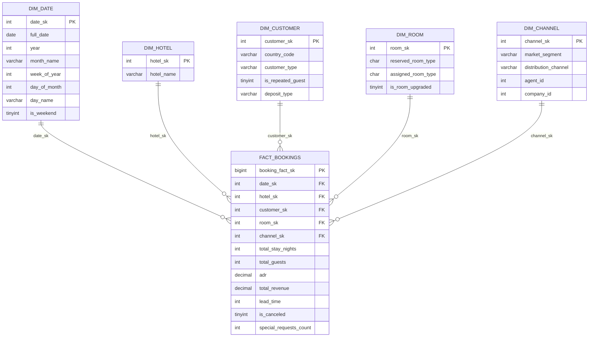
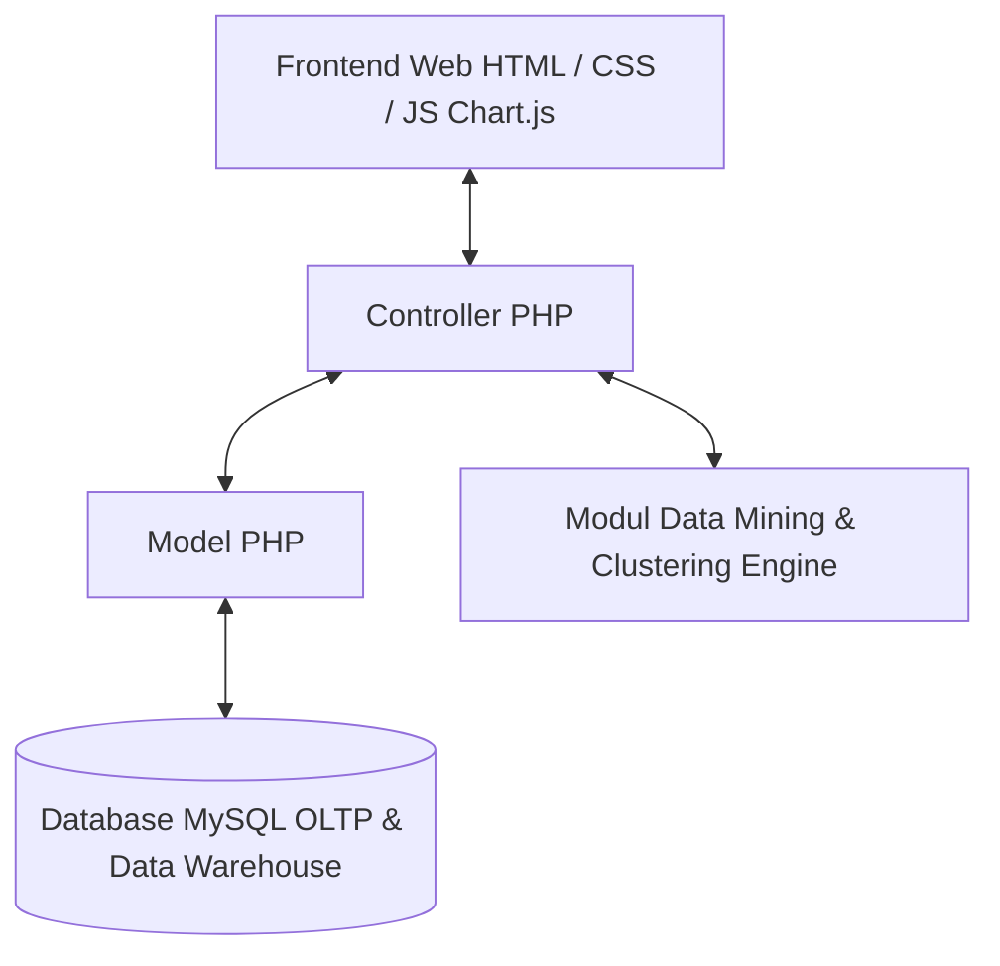

# Perancangan Database, Business Intelligence & Aplikasi Web Hotel Booking Analytics

Dokumen ini merupakan rancangan komprehensif sistem Business Intelligence (BI) dan Aplikasi Web berbasis **PHP & MySQL** menggunakan dataset `data_booking_hotel_17000.csv`.

---

## Proposed Changes

### 1. Entity Relationship Diagram (ERD) - Skema OLTP

Skema ini dirancang ternormalisasi (**3NF**) untuk menjamin konsistensi data operasional website saat melakukan input, update, atau hapus data reservasi hotel.

#### Detail Tabel Structure Skema OLTP (3NF)

##### Tabel: `HOTELS`
| Tipe Data | Nama Atribut | Constraint | Keterangan |
| :--- | :--- | :--- | :--- |
| `int` | `id` | PK | Auto Increment, ID Unik Hotel |
| `varchar` | `hotel_name` | NOT NULL | Nama Jenis Hotel (Resort Hotel / City Hotel) |

##### Tabel: `COUNTRIES`
| Tipe Data | Nama Atribut | Constraint | Keterangan |
| :--- | :--- | :--- | :--- |
| `varchar` | `country_code` | PK | Kode Negara ISO (PRT, GBR, ESP, USA, dll) |
| `varchar` | `country_name` | NULL | Nama Lengkap Negara Asal Tamu |

##### Tabel: `ROOM_TYPES`
| Tipe Data | Nama Atribut | Constraint | Keterangan |
| :--- | :--- | :--- | :--- |
| `char` | `room_type_code` | PK | Kode Tipe Kamar (A, B, C, D, E, F, G, H, L, P) |
| `varchar` | `description` | NULL | Deskripsi Fasilitas & Kategori Kamar |

##### Tabel: `MARKET_SEGMENTS`
| Tipe Data | Nama Atribut | Constraint | Keterangan |
| :--- | :--- | :--- | :--- |
| `int` | `id` | PK | Auto Increment, ID Segmen |
| `varchar` | `segment_name` | NOT NULL, UNIQUE | Segmen Pasar (Direct, Corporate, Online TA, Offline TA/TO) |

##### Tabel: `DISTRIBUTION_CHANNELS`
| Tipe Data | Nama Atribut | Constraint | Keterangan |
| :--- | :--- | :--- | :--- |
| `int` | `id` | PK | Auto Increment, ID Saluran |
| `varchar` | `channel_name` | NOT NULL, UNIQUE | Saluran Distribusi (Direct, Corporate, TA/TO, GDS) |

##### Tabel: `CUSTOMER_TYPES`
| Tipe Data | Nama Atribut | Constraint | Keterangan |
| :--- | :--- | :--- | :--- |
| `int` | `id` | PK | Auto Increment, ID Tipe Pelanggan |
| `varchar` | `type_name` | NOT NULL | Jenis Pelanggan (Transient, Contract, Group, Transient-Party) |

##### Tabel: `DEPOSIT_TYPES`
| Tipe Data | Nama Atribut | Constraint | Keterangan |
| :--- | :--- | :--- | :--- |
| `int` | `id` | PK | Auto Increment, ID Deposit |
| `varchar` | `deposit_name` | NOT NULL | Jenis Deposit (No Deposit, Non Refund, Refundable) |

##### Tabel: `MEALS`
| Tipe Data | Nama Atribut | Constraint | Keterangan |
| :--- | :--- | :--- | :--- |
| `int` | `id` | PK | Auto Increment, ID Paket Makan |
| `varchar` | `meal_code` | NOT NULL | Kode Paket (BB, HB, FB, SC, Undefined) |
| `varchar` | `meal_description` | NULL | Keterangan (Bed & Breakfast, Half Board, Full Board, Self Catering) |

##### Tabel: `AGENTS`
| Tipe Data | Nama Atribut | Constraint | Keterangan |
| :--- | :--- | :--- | :--- |
| `int` | `id` | PK | ID Agen Perjalanan Travel (Travel Agent) |
| `varchar` | `agent_name` | NULL | Nama Agen / Perusahaan Travel |

##### Tabel: `COMPANIES`
| Tipe Data | Nama Atribut | Constraint | Keterangan |
| :--- | :--- | :--- | :--- |
| `int` | `id` | PK | ID Perusahaan Korporat |
| `varchar` | `company_name` | NULL | Nama Perusahaan Penyewa |

##### Tabel: `BOOKINGS` (Tabel Transaksi Utama)
| Tipe Data | Nama Atribut | Constraint | Keterangan |
| :--- | :--- | :--- | :--- |
| `bigint` | `id` | PK | Auto Increment, ID Unik Reservasi |
| `int` | `hotel_id` | FK | Hubungan ke `HOTELS.id` |
| `int` | `lead_time` | NOT NULL | Waktu Jeda Pemesanan (dalam Hari) |
| `date` | `arrival_date` | NOT NULL | Tanggal Kedatangan Tamu |
| `int` | `stays_in_weekend_nights` | DEFAULT 0 | Durasi Menginap Malam Akhir Pekan |
| `int` | `stays_in_week_nights` | DEFAULT 0 | Durasi Menginap Malam Hari Kerja |
| `int` | `adults` | DEFAULT 1 | Jumlah Tamu Dewasa |
| `int` | `children` | DEFAULT 0 | Jumlah Tamu Anak-anak |
| `int` | `babies` | DEFAULT 0 | Jumlah Bayi |
| `int` | `meal_id` | FK | Hubungan ke `MEALS.id` |
| `varchar` | `country_code` | FK | Hubungan ke `COUNTRIES.country_code` |
| `int` | `segment_id` | FK | Hubungan ke `MARKET_SEGMENTS.id` |
| `int` | `channel_id` | FK | Hubungan ke `DISTRIBUTION_CHANNELS.id` |
| `char` | `reserved_room_type` | FK | Hubungan ke `ROOM_TYPES.room_type_code` (Kamar dipesan) |
| `char` | `assigned_room_type` | FK | Hubungan ke `ROOM_TYPES.room_type_code` (Kamar ditempati) |
| `int` | `deposit_id` | FK | Hubungan ke `DEPOSIT_TYPES.id` |
| `int` | `customer_type_id` | FK | Hubungan ke `CUSTOMER_TYPES.id` |
| `int` | `agent_id` | FK, NULL | Hubungan ke `AGENTS.id` |
| `int` | `company_id` | FK, NULL | Hubungan ke `COMPANIES.id` |
| `decimal` | `adr` | NOT NULL | Average Daily Rate (Harga Rata-Rata Per Malam) |
| `tinyint` | `is_canceled` | NOT NULL | Status Batal (0 = Tidak Batal, 1 = Batal) |
| `varchar` | `reservation_status` | NOT NULL | Status Akhir (Check-Out, Canceled, No-Show) |
| `date` | `reservation_status_date` | NOT NULL | Tanggal Update Status Terakhir |
| `timestamp` | `created_at` | DEFAULT CURRENT_TIMESTAMP | Tanggal Transaksi Dimasukkan ke System |

---

### 2. Data Warehouse Diagram - Skema OLAP (Star Schema)

Skema Data Warehouse dirancang dengan **Star Schema** untuk mempercepat kueri analitis, pemrosesan cube, dan dashboard eksekutif.

---

### 3. Fitur Business Intelligence (BI Services)

#### A. Integration Services (ETL Process)
1. **Extract**: Membaca data mentah Excel/CSV (`data_booking_hotel_17000.csv`) atau delta update dari database MySQL OLTP.
2. **Transform (Cleansing & Enrichment)**:
   - Mengubah nilai `agent` dan `company` bernilai NULL/kosong menjadi nilai standar `0` (Unknown).
   - Pembersihan nilai `children` dari desimal (`0.0`) menjadi integer (`0`).
   - Kalkulasi variabel turunan: `total_stay_nights` = `stays_in_weekend_nights` + `stays_in_week_nights`.
   - Pembuatan variabel penanda `is_room_upgraded` = 1 jika `reserved_room_type` != `assigned_room_type`.
3. **Load**: Memuat data ke tabel dimensi (`Dim_Date`, `Dim_Hotel`, `Dim_Customer`, `Dim_Room`, `Dim_Channel`) dan pemuatan bertahap ke `Fact_Bookings`.

#### B. Analysis Services (SSAS & OLAP Cube)
* **Total Revenue**: $\sum (\text{adr} \times \text{total\_stay\_nights})$ untuk reservasi non-batal (`is_canceled = 0`).
* **Cancellation Rate**: $(\text{Jumlah Reservasi Batal} / \text{Total Reservasi}) \times 100\%$.
* **Average Daily Rate (ADR)**: Rata-rata harga sewa harian kamar.
* **RevPAR (Revenue Per Available Room)**: Metrik efisiensi pendapatan berbasis kapasitas kamar.
* **Average Lead Time**: Jarak rata-rata antara pemesanan dan kedatangan.

#### C. Data Mining (Prediksi Pembatalan Reservasi)
* **Tujuan**: Memprediksi risiko kecenderungan calon tamu membatalkan pesanan.
* **Model Algoritma**: Decision Tree / Random Forest / Logistic Regression.
* **Variabel Penentu (Predictors)**: `lead_time`, `deposit_type`, `previous_cancellations`, `booking_changes`, `market_segment`, `special_requests`.
* **Output Predictor**: Klasifikasi Risiko Pembatalan (**High Risk**, **Medium Risk**, **Low Risk**).

#### D. Clustering Support (Segmentasi Profil Tamu)
* **Algoritma**: **K-Means Clustering**.
* **Dimensi Klaster**: `Lead Time`, `ADR`, `Total Duration of Stay`, `Special Requests`.
* **Hasil Pengelompokan**:
  - **Cluster 1 (High-Value Guests)**: Menginap lama, pengeluaran ADR tinggi, reservasi via Online TA.
  - **Cluster 2 (Short-Stay Corporate)**: Jeda waktu booking singkat, menginap 1-2 malam weekday, segmen perusahaan.
  - **Cluster 3 (Budget & High Risk)**: Lead time panjang, tanpa deposit, riwayat pembatalan ada.

#### E. Reporting Services (SSRS & Dashboard Executive)
* **Executive Dashboard**: Visualisasi tren pendapatan harian/bulanan, perbandingan Resort vs City Hotel.
* **Loss Revenue Analysis**: Laporan potensi pendapatan hilang akibat pembatalan.
* **Channel & Agent Performance**: Peringkat agen dan saluran pemesanan paling produktif.
* **Demographic & Room Upgrade Report**: Peta kebiasaan tamu berdasarkan negara asal dan rasio upgrade kamar.

---

### 4. Perancangan Aplikasi Web (PHP & MySQL)

Aplikasi web dikembangkan menggunakan skema arsitektur **MVC (Model-View-Controller)** dengan bahasa **PHP** dan database **MySQL**.

#### Komponen Utama Aplikasi Web:
1. **Dashboard Executive**: Visualisasi Ringkasan KPI (Total Revenue, Occupancy Rate, Cancellation Rate, Grafik Line/Bar Tren).
2. **Kelola Data Reservasi (CRUD)**: Input, ubah, hapus, dan cari data booking hotel.
3. **Modul Prediksi Pembatalan**: Form interaktif untuk menguji tingkat risiko pembatalan reservasi baru.
4. **Modul Segmentasi Klaster Tamu**: Visualisasi titik klaster pelanggan untuk rekomendasi strategi pemasaran.
5. **Modul Reporting & Ekspor Data**: Filter kustom laporan dengan opsi cetak **PDF**, **Excel**, dan **CSV**.
